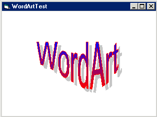



## WordArt Control

### Description

This control is similar to the wordart control in MS Word. It allows outline, solid fill, gradient fill, pattern fill, as well as stretching the text in several different ways. Uses the GetGlyphOutline API, bezier curves, least squares and polynomial curve fitting, etc.
 
### More Info
 

             |
---                |---
**Submitted On**   |2002-07-29 22:10:14
**By**             |[Tim Arheit](https://github.com/Planet-Source-Code/PSCIndex/blob/master/ByAuthor/tim-arheit.md)
**Level**          |Advanced
**User Rating**    |4.8 (67 globes from 14 users)
**Compatibility**  |VB 6\.0
**Category**       |[Graphics](https://github.com/Planet-Source-Code/PSCIndex/blob/master/ByCategory/graphics__1-46.md)
**World**          |[Visual Basic](https://github.com/Planet-Source-Code/PSCIndex/blob/master/ByWorld/visual-basic.md)
**Archive File**   |[WordArt\_Co1124747302002\.zip](https://github.com/Planet-Source-Code/tim-arheit-wordart-control__1-37388/archive/master.zip)

